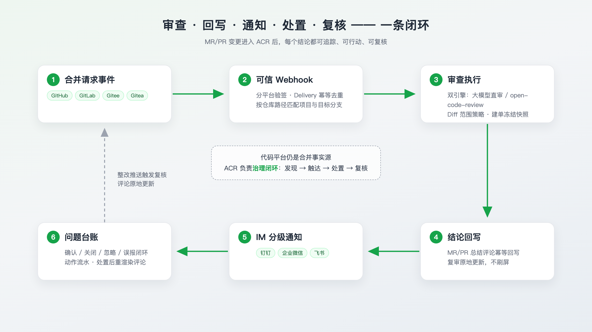
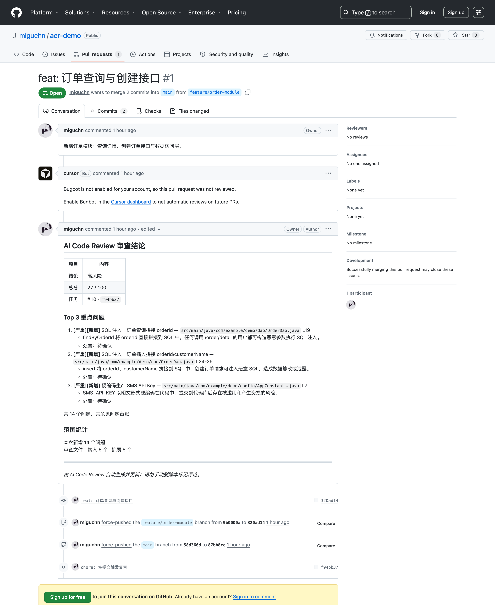
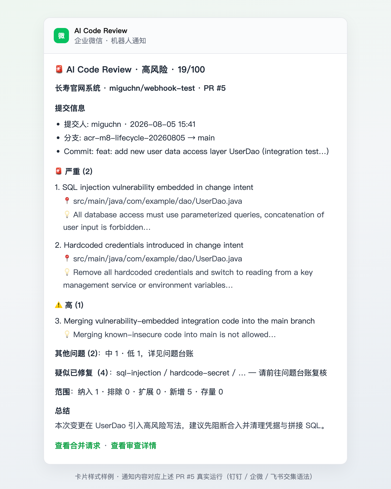
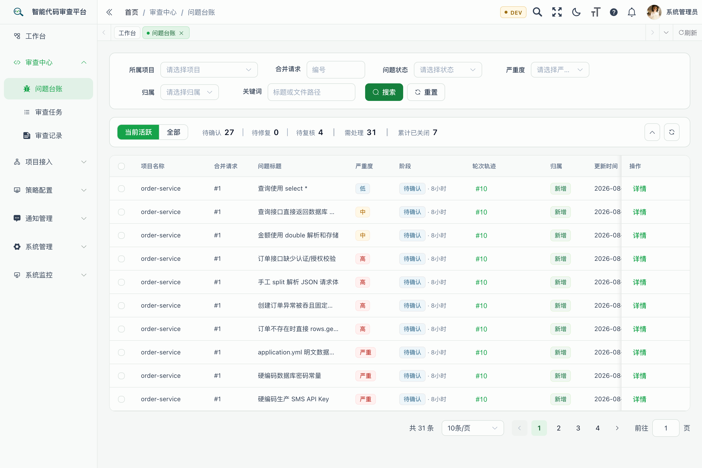
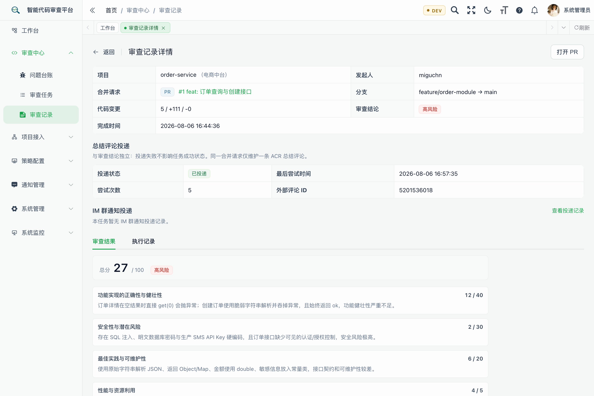
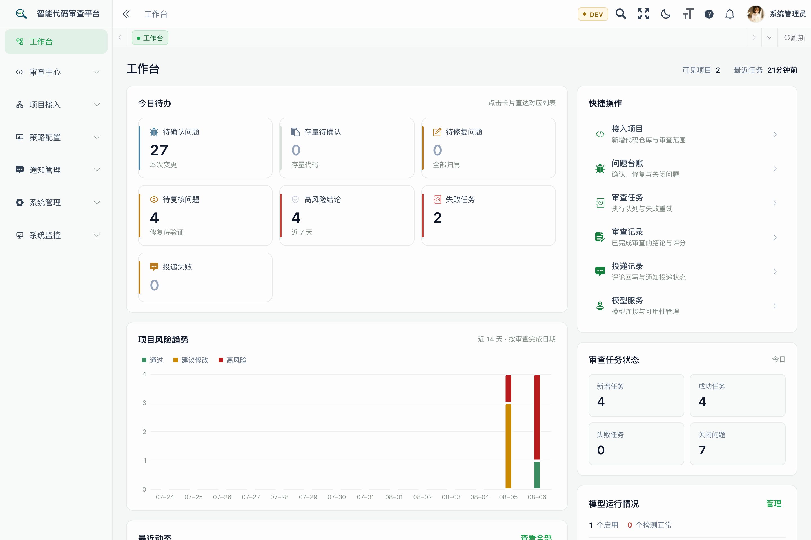

<div align="center">
    <h1>AI Code Review — 企业级代码审查治理平台</h1>
</div>

<div align="center">
  <h4>把 AI 代码审查从「一次性评论」变成「企业治理闭环」——四大代码平台 × 双引擎 × 中文 IM × 问题台账。</h4>
</div>

> **先看真东西（30 秒）**：[这个公开 PR](https://github.com/miguchn/acr-demo/pull/1) 故意保留了 SQL 注入、硬编码凭据等典型问题，PR 里的审查评论是本平台真实运行后自动回写的总结评论——不是截图，可以打开自己翻。

<p align="center">
  <a href="LICENSE"></a>
  
  
  
</p>
<p align="center">
  
  
  
  
</p>
<p align="center">
  <a href="README.en.md">English</a> | 简体中文
</p>

## 为什么做 AI Code Review

多数 AI Review 停在「在 PR 上留几条评论」：评论被刷走、没人跟进、没人负责、无法审计。企业要的不是更多评论，而是闭环——**发现 → 触达 → 处置 → 复核**，每个结论可追踪、可行动、可复核。

| | 普通 AI Review | AI Code Review |
|---|---|---|
| 结论送达 | 留完评论就走，新一轮就刷走 | 总结评论幂等回写，复审原地更新不刷屏 |
| 问题跟进 | 靠人记，刷走就没了 | 问题台账：确认 / 关闭 / 忽略 / 误报闭环，轮次对账自动转待复核 |
| 触达 | 靠开发者自己来看 | 钉钉 / 企业微信 / 飞书分级通知，到人到群 |
| 平台覆盖 | 往往只支持一家 | GitHub / GitLab / Gitee / Gitea 统一契约 |
| 部署与数据 | 代码外发 SaaS 居多 | 私有化部署，凭据 AES-GCM 加密，模型端点白名单 |

## 核心能力

| 能力 | 说明 |
|---|---|
| 🧩 四平台统一接入 | GitHub / GitLab / Gitee / Gitea 统一适配层，仓库路径跨平台唯一匹配，分平台 Webhook 与投递渠道 |
| 🔐 可信 Webhook | 分平台验签、Delivery 幂等去重、按仓库路径与目标分支匹配，伪造与错位事件直接拒绝 |
| ⚙️ 双引擎审查 | 大模型直审或 open-code-review 引擎可选；Diff 范围策略（纳入 / 排除 / 扩展），建单冻结快照 |
| 💬 幂等回写 | 同一 MR/PR 只维护一条 ACR 总结评论，复审原地更新；投递与审查结论解耦，投递失败不污染结论 |
| 📣 IM 分级通知 | 钉钉 / 企业微信 / 飞书三渠道，按结论与风险分级推送 |
| 📒 问题台账 | 问题全生命周期：确认、关闭、忽略误报、重开；轮次轨迹与复核证据；批量处置；工作台待办聚合 |

## 闭环如何工作

<p align="center">
  
</p>

代码平台仍是合并事实源；ACR 负责治理闭环：MR/PR 事件 → 可信 Webhook → 审查执行 → 结论回写 → IM 通知 → 问题台账 → 整改推送触发复核。

## 真实运行截图

以下均为真实环境截图（IM 通知卡片为样式样例，内容来自真实运行），演示数据来自[上述公开 demo 仓库](https://github.com/miguchn/acr-demo/pull/1)。

**PR 总结评论回写**（高风险结论、Top 3 重点问题、范围统计；公开 PR 可看全文）：

<p align="center"></p>

**IM 分级通知**（企微卡片样式样例，内容对应上述 PR #5 真实运行）：审查完成后按风险分级推送到人与群，重点问题、疑似已修复复核提醒、范围统计一卡直达；钉钉 / 企微 / 飞书三渠道：

<p align="center"></p>

**问题台账**（严重度徽章、阶段、轮次轨迹、归属，总览条一键筛选）：

<p align="center"></p>

**审查记录详情**（四维评分与模型评语、总结评论投递状态与外部评论 ID）：

<p align="center"></p>

**工作台**（今日待办、项目风险趋势、任务状态一眼清）：

<p align="center"></p>

## 快速启动（Docker Compose 一键）

要求：Docker Engine + Compose v2，宿主机 80 端口空闲。首次构建含后端与前端全量依赖，视网络约 5–15 分钟。

```bash
cp .env.example .env
# 编辑 .env，填入主密钥：ACR_CREDENTIAL_MASTER_KEY=$(openssl rand -base64 32)
docker compose up -d --build
```

四个服务均 healthy 后打开 http://127.0.0.1 ，默认管理员 `admin / admin123`。这是试用环境，非生产加固方案，生产部署见[部署说明](docs/deployment.md)。

接入你自己的仓库（以 GitHub 为例，约 5 分钟）：

1. 「项目接入」新增 Git 凭据并创建项目（仓库路径、目标分支）；
2. 连接测试通过后启用，平台给出 Webhook 地址与签名密钥；
3. 在仓库设置 Webhook，把 merge request / push 事件指向上面的地址，并回填签名密钥；
4. 提一个 MR/PR，一分钟后看 PR 总结评论与问题台账。

## 与主流工具的差异

| | [PR-Agent](https://github.com/qodo-ai/pr-agent) | [CodeRabbit](https://www.coderabbit.ai/) | 裸跑 [open-code-review](https://github.com/alibaba/open-code-review) | **AI Code Review** |
|---|---|---|---|---|
| 形态 | 开源工具 | 商业 SaaS（闭源） | 开源引擎 / CLI | 开源私有化平台 |
| 中文 IM 触达 | 无 | 无 | 无 | 钉钉 / 企微 / 飞书 |
| 问题台账与复核闭环 | 无 | 平台侧部分 | 无 | 全生命周期 + 轮次对账 |
| 四平台统一治理 | 社区适配 | 是 | 依赖自行集成 | 统一契约 |
| 私有化 | 自行搭建 | 商业企业版 | 本地运行 | 开箱即用 |

open-code-review 是本平台可选引擎之一；AI Code Review 在其引擎能力之上，补上事件、凭据、回写、通知与台账这些平台侧治理能力。

## 当前阶段与路线图

**诚实说明**：V0.1（MVP）已交付并通过 GitHub 真实仓库全链路验收；M8 问题生命周期、M8.1 台账可视化与批量处置、M9 功能助手已交付；当前处于 V0.2 核心版迭代（审查配置与推送审查类型、严重级别差异化策略、inline 评论与质量门禁影子评估等在规划中）。验收遗留：真实测试仓库连续运行积累、GitLab / Gitee / Gitea 真实闭环待实例。

- [产品路线图](docs/planning/product-roadmap.md) —— 定位、非目标与里程碑验收口径全文
- [架构说明](docs/planning/architecture-scaffold.md) / [SQL 脚本说明](sql/README.md)

## 文档与参考

| 文档 | 说明 |
|------|------|
| [部署说明](docs/deployment.md) | Docker Compose 一键试用、手动部署与升级路径 |
| [CHANGELOG](CHANGELOG.md) | 已交付切片记录 |
| [贡献指南](CONTRIBUTING.md) / [安全政策](SECURITY.md) | 如何参与与报告安全问题 |

参考项目：[PR-Agent](https://github.com/qodo-ai/pr-agent)（Provider 能力契约）、[AI-Codereview-Gitlab](https://github.com/sunmh207/AI-Codereview-Gitlab)（IM 触达轻量闭环）、[alibaba/open-code-review](https://github.com/alibaba/open-code-review)（引擎候选）。参考项目只用于能力验证与取舍，不作为功能模板。

## 参与贡献

- Conventional Commits（`feat:`, `fix:`, `refactor:`, `docs:`），功能分支 `feature/<name>`
- 代码提交前必须通过编译与单元测试（`mvn test` + `cd acr-ui && npm run build:prod`）
- 业务切片开发前先明确范围与验收

## 开源协议

本项目基于 [Apache License 2.0](LICENSE) 开源；第三方组件按各自原始协议授权。
