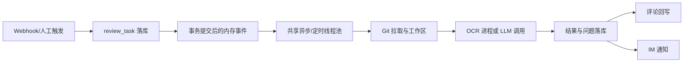
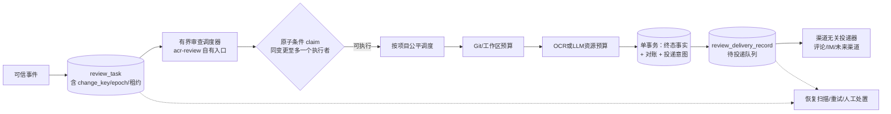

# 企业级架构风险修复设计文档

## 1. 文档定位

| 项目 | 内容 |
|---|---|
| 版本 | v1.1（架构评审修订版，修订记录见 1.1 节） |
| 目的 | 针对线程/任务资源分配、并发控制、调度、隔离、超时和失败恢复风险，给出可落地的最小修复设计，并完成专项架构 Review |
| 审阅基线 | 当前代码（含工作区未提交变更的复核声明）、`README.md`、`docs/planning/`、`rules/`、`sql/README.md` 双轨初始化策略及前一轮架构审计结论 |
| 本阶段 | 只做设计和架构评审，不修改业务代码，不新增业务功能 |
| 目标部署 | 单企业内部部署；先满足稳定试点，再满足多实例长期运行 |
| 设计约束 | 继续使用 MySQL、Spring/Java 执行器能力和既有定时能力；将审查执行与通用异步池隔离；无容量证据前不引入 MQ、微服务或工作流引擎 |
| 实施交接 | 本文档为实施基线。实施方（含其他 Agent 会话）必须先按第 11 节重新核验代码现状，再按第 8 节切片顺序执行；不得按文档盲改 |

工作区当前存在未提交的业务/UI变更。本设计不覆盖、不评价其业务意图；实施前需以合并后的代码重新执行并发和故障验证，并重新核对第 11 节证据索引中的文件与行为是否仍然成立。

### 1.1 v1.1 修订记录

| 编号 | 修订内容 | 原因 |
|---|---|---|
| C1 | R3 变更键泛化：由仅 PR/MR 的 `change_number` 扩展为同时覆盖 PUSH 线（`source_branch` 归一化） | M10 push 审查已上线（`sql/33_push_review_m10.sql`），同一分支连续 push 的乱序与 PR 多提交同构，v1.0 未覆盖 |
| C2 | 明确 P0 恢复扫描使用 `acr-review` 自有调度入口，不经过 `acr-quartz` | `rules/architecture.md` 要求 quartz→review 依赖须单独评审，P0 不得依赖未评审的依赖方向 |
| C3 | 明确所有租约/超时比较以数据库时钟为唯一时间源 | 现状代码混用 JVM 时钟（`isStaleRunning`）与 DB 时钟（`claimTask` 的 `sysdate()`），多实例下时钟漂移会破坏 fencing |
| C4 | 投递补偿事务边界明确包含问题对账结果；对账失败不再静默降级，转为可重试失败 | v1.0 的事务边界描述无法生成投递意图（对账产出是评论内容输入）；静默降级会破坏台账正确性 |
| C5 | 人工重试与自动重试统一为同一重试状态机 | M6.1 已有 `retryDelivery`/`retryDeliveryById` 人工入口，双路径必然导致重复投递 |
| C6 | P0 内部给出切片顺序 S1–S6，每片独立可验收 | v1.0 六大阻断项无实施次序，无法灰度与回滚 |
| C7 | 验收设计补充验收环境、事件发生器和两级验收口径 | v1.0 的"100 并发事件、20 仓库"未定义环境与工具，判据不可执行 |
| C8 | R4/R5 现状描述按代码实况修正（见第 4 节） | 代码核验发现 v1.0 描述偏轻：Git preparer 存在管道填满导致的永久挂起；OCR runner 读取超时异常会跳过进程清理；OkHttp 客户端每次调用新建；OCR 并发名额抢不到时直接置 FAILED 终态 |
| C9 | 新增第 6 节数据结构与脚本策略、第 7 节产品级边界与长期演进兼容 | 避免实施期临时决策造成后续反复重构 |
| C10 | 取消 v1.0 的独立 gate 控制表，改为 `review_task.change_key` 物化列 + claim 条件 + 代次围栏 | 同等串行语义下对象更少，避免 gate 行的生命周期与热点行管理 |
| C11 | 修正第 11 节证据索引路径（`OkHttpUtils` 实际位于 `utils/http/`），补充四个 provider preparer 与事件监听器 | v1.0 路径不准确，实施定位会偏差 |

## 2. 企业级准入结论

当前架构暂不具备企业级高并发和长期稳定部署条件。它具备单任务幂等、数据库原子抢占、执行记录、Webhook 去重、投递记录和工作区 UUID 隔离等良好基础，但缺少一个持久、可恢复、可限流、可观测的执行控制面。

本方案落地后，可解决任务丢失、同一变更乱序、线程池相互拖垮、外部进程无法硬超时、结果投递不可补偿和多实例重复执行等主要结构性问题；但"具备企业级条件"必须以实施完成并通过本文第 9 节的容量、故障恢复和长稳验收为前提，不能由设计文档本身推定。

## 3. 现状与目标架构

### 3.1 当前主链路

关键缺口是：C 不是持久队列；D 不是按审查任务隔离的有界调度器；E/F 的资源预算不统一；G/H/I 之间没有可恢复的投递工作流；同一逻辑变更（PR 或分支）上的多个任务没有顺序栅栏。

### 3.2 目标主链路

设计原则：

- MySQL 保存业务事实和恢复依据；内存事件只做低延迟唤醒；
- 调度队列有界；每个外部副作用独立重试；
- 跨实例更新必须带租约和执行代次；
- 同一逻辑变更（PR 或 push 分支）的结果必须有顺序和"最新版本"栅栏；
- 所有租约、心跳、到期比较以数据库时钟为唯一时间源，Java 侧只传递时长。

## 4. 关键风险清单

> 本节"现状与根因"已按 v1.1 评审时的代码核验修正（C8）。实施时仍需复核，代码可能继续演进。

| 编号 | 风险 | 现状与根因 | 影响 | 优先级 |
|---|---|---|---|---|
| R1 | 内存派发不可恢复 | 任务落库后依赖 `AFTER_COMMIT` 事务事件提交到共享定时池（`ReviewTaskExecuteEventListener`），无审查任务启动/周期恢复扫描 | 进程重启、线程池拒绝或事件丢失后任务长期停在 PENDING，形成无声积压 | P0 |
| R2 | 调度无界且资源混用 | 共享 `ScheduledThreadPoolExecutor` 内部延迟队列无界；通用异步任务和审查任务共池；`threadPoolTaskExecutor` 使用 `CallerRunsPolicy`，饱和时把工作压回调用线程 | 多仓库突发时队列堆积、接入线程被拖慢；审查实际使用的定时池没有任何指标暴露 | P0 |
| R3 | 同一变更多提交无序（PR 与 push 两线） | `claimTask` 仅按 `task_id + task_status` 原子抢占，无变更级串行、无最新 head 校验、无执行代次围栏；问题对账与评论回写存在读改写竞争。push 线任务以 `pr_number=0` 哨兵 + `source_branch` 标识，同样无顺序保护 | 旧提交晚完成覆盖新提交，问题状态回退，评论内容倒灌或重复 | P0 |
| R4 | 外部进程/HTTP 超时不硬 | 三处独立缺陷：① Git preparer `runGit` 先 `waitFor(timeout)` 再 `readAllBytes()` 最后 `destroyForcibly`，git 输出超过管道缓冲（约 64KB）时进程阻塞写管道，超时后 `readAllBytes()` 永久挂起，强杀永远执行不到（四个 provider preparer 同构）；② OCR runner 输出虽并行消费，但超时路径先等读取任务（各 5s）再杀进程树，且读取超时抛 IOException 会直接跳过 `destroyProcessTree`，留下孤儿进程；③ LLM 调用每次新建 OkHttpClient（连接池不复用），只有 connect/read 超时，无 call 级 deadline，流式响应下总时长不受控 | 线程、进程、连接和工作区长期占用，超时机制在特定条件下完全失效，任务吞吐下降并产生孤儿进程 | P0 |
| R5 | 资源隔离和背压不足 | OCR semaphore 在工作区准备完成后才 `tryAcquire`，且抢不到名额直接将任务置 FAILED 终态（不回到可重试状态）；LLM 路径无任何全局并发预算；Git、模型、通知未按依赖和项目隔离 | 工作区在排队期间白占磁盘；突发流量把本可重试的任务打成终态失败；大仓库或慢模型占满线程/连接，小项目被饿死 | P0 |
| R6 | 结果与投递存在崩溃窗口 | 任务终态落库后在同一执行线程顺序执行对账、评论回写、IM 通知（`deliverQuietly`/`notifyQuietly`），外部成功与本地记录之间不是原子操作；投递失败仅记日志；只有人工重试入口（`retryDelivery`），无自动恢复扫描 | 重启后漏通知、重复通知，审查事实与外部交付状态不一致，且无人发现 | P0 |
| R7 | 租约、心跳和旧执行隔离不足 | stale RUNNING 通过纯 JVM 时间比较允许再次 claim（`isStaleRunning`），claim/更新缺少 worker/epoch fencing；旧线程恢复后仍可能写结果 | 多实例或慢任务下出现双写、错误覆盖和运行记录对账不一致 | P0 |
| R8 | 运维和横向部署能力不足 | 业务 SLI 不完整；执行器指标只绑定通用 `ThreadPoolTaskExecutor`，未覆盖实际审查定时池；Compose 为单后端容器，无优雅排空和容量/恢复手册 | 积压、超时和依赖故障不能及时发现；无法安全滚动升级或扩容 | P1 |

已有能力应保留：Webhook `(provider, delivery_id)` 去重、任务事件唯一键、任务原子 claim、`review_task_run` 历史、投递幂等键、输出/Diff 上限、工作区 UUID 隔离、Provider 适配边界和配置快照。

## 5. 修复设计

### 5.1 R1/R7：持久调度、租约和恢复

#### 方案

1. `review_task` 继续作为唯一事实源。内存事件只负责"尽快唤醒"，不得作为唯一触发条件。
2. 增加数据库驱动的 dispatcher：按 `task_status IN ('PENDING','RETRYING')`、`next_run_at <= sysdate()`、项目公平策略取任务；claim 沿用现有原子条件更新模式（`UPDATE ... WHERE 条件` 影响行数判定），不使用 `SELECT FOR UPDATE`，避免 InnoDB 间隙锁放大。
3. claim 生成 `lease_owner`、`lease_until`、`heartbeat_at` 并递增 `execution_epoch`。所有运行、成功、失败、取消和投递前置更新都必须带 `task_id + execution_epoch + lease_owner` 条件；条件不匹配即视为旧执行，禁止写入。
4. **调度入口归属（对应 C2）**：恢复扫描与周期唤醒使用 `acr-review` 自有调度入口（Spring `@Scheduled` 或模块内专用 `ScheduledExecutorService`），不经过 `acr-quartz`。理由：`rules/architecture.md` 规定 quartz→review 依赖必须在对应功能中单独评审，P0 修复不得依赖未评审的依赖方向。Quartz 整合留给后续功能单独评审。
5. **时间源（对应 C3）**：`next_run_at`、`lease_until`、`heartbeat_at` 的写入与比较全部在 SQL 中以 `sysdate()`/`NOW()` 完成；Java 侧只传递时长参数（租约秒数、退避秒数）。现状 `isStaleRunning` 的 JVM 时钟比较必须废弃，统一为租约到期判定。
6. 重试采用错误分类和指数退避（分类见 5.4 节失败分类与第 6 节参数）：网络/限流/超时/临时依赖故障可重试；凭据、参数、超限和解析失败不自动重试，进入可查询的人工处置状态；超过重试上限转人工终态。保留 `last_error_code`、`retry_count` 和 `next_run_at`，复用现有 `failure_message` 承载可读原因。
7. 优雅停机：停止取新任务，等待租约内任务在截止时间内完成；超时释放租约（写回 `lease_until = NULL` 或置为已过期），由恢复扫描接管。

#### 边界

- 不引入 MQ；不新增通用任务表；不把任何定时组件改造成通用工作流。
- 不在 Webhook 请求线程执行审查；队列满时任务保留 PENDING/RETRYING 并告警，不使用可能阻塞接入线程的 CallerRuns 兜底。
- 恢复扫描周期建议 5–15 秒（参数化），扫描只做唤醒与接管，不承担业务事实判定。

### 5.2 R2/R5：有界调度与资源隔离

#### 方案

建立专用的审查执行池，不再与通用异步任务共享。资源分为四类预算：

| 预算 | 控制对象 | 规则 |
|---|---|---|
| 调度预算 | 待执行任务数、队列容量、单项目并发 | 队列有界；按项目轮询，避免单仓库霸占队列；预留优先级字段语义（P1 启用），P0 只做公平轮询 |
| Git/工作区预算 | 拉取、解压、磁盘和工作区数 | 在准备工作区前获取；超限回到 RETRYING 状态并延迟，不占用审查执行线程 |
| 审查引擎预算 | OCR 进程和 LLM 调用分别限流 | OCR 与 LLM 各自 semaphore/配额；模型按 endpoint/供应商限流；每任务只占用一个执行名额 |
| 交付预算 | Git 回写、IM 通知连接与速率 | 独立投递器和重试预算，不能阻塞审查主池 |

调度器应先检查变更顺序（5.3 节）和依赖预算，再创建工作区；只有拿到相应预算才进入外部调用。队列拒绝、依赖限流和资源不足必须转成可观察状态，而不是静默丢弃。

#### 现状缺陷修正（对应 C8）

- OCR semaphore 获取时机前移到工作区准备之前（现行为准备之后）。
- 名额/预算抢不到时，任务回到 RETRYING 并按退避延迟，不得置 FAILED 终态（现行为直接失败并提示"请稍后重试"，把可恢复的资源竞争变成了用户的终态失败）。
- LLM 路径新增全局并发预算（现行为零控制）。

#### 边界

- 初期不做跨企业多租户配额；项目级公平和单实例总量上限即可满足当前单企业范围。
- 不新增"自动降级模型"业务策略；依赖失败时按错误分类和重试策略处理，结论口径不被静默改变。

### 5.3 R3：同一变更的顺序、去重和最新版本栅栏（PR 与 push 两线）

#### 逻辑变更键（对应 C1）

定义归一化变更键 `change_key`，物化为 `review_task` 上的列并建索引，作为顺序、去重和栅栏的统一维度：

| 事件线 | change_key 归一化规则 | 说明 |
|---|---|---|
| PR/MR | `PR#<pr_number>` | 与现有 `idx_task_pr (project_id, pr_number)` 语义一致 |
| PUSH | `PUSH#<source_branch>` | push 任务 `pr_number` 为哨兵 0，分支取 `source_branch`；与 `review_issue.ref_branch` 的台账维度对齐 |

`change_key` 的完整作用域为 `project_id + change_key`。任务到达序号不新增列，直接以自增 `task_id` 单调性表达（先到者 task_id 更小）。未来新增事件类型（tag、全量扫描等）只需扩展归一化规则，不改调度与栅栏机制。

#### 方案

1. 不新建独立 gate 控制表（对应 C10）。"同一变更至多一个主执行者"由 claim 条件实现：仅当该 `project_id + change_key` 下不存在其他 RUNNING 任务、且本任务为最新未替代任务时，claim 才成功。
2. 新 head 到达（建单事务内）：将同变更下尚未开始的旧任务（PENDING/RETRYING）条件更新为 `SUPERSEDED`，记录 `superseded_by` 指向新任务。正在运行的旧任务允许完成计算，但在问题对账、门禁和评论回写前必须检查自己仍是该变更的最新任务，否则只能保存历史结果，不得改变当前问题状态或覆盖当前评论。
3. 对账使用"任务 head + 规则/模型快照 + change_key"作为版本条件；不采用仅按行号或文本的隐式合并。
4. 评论回写使用最新任务栅栏和稳定 marker；marker 内容嵌入 `run_id`，使外部评论可回溯到具体执行代次。旧任务即使外部调用成功，也只能记录 `SKIPPED_STALE`，不得更新同一 marker。
5. **Provider 可行性确认（实施前置）**：marker 的"查找—编辑—更新"依赖各平台评论 API 能力。实施切片开工前必须产出 GitHub/GitLab/Gitee/Gitea 四平台的确认表（能否按 marker 检索评论、能否编辑、限流策略），能力不足的平台降级为"追加新评论 + 标注替代关系"，不得静默丢评论。

#### 边界

- 不承诺取消外部模型请求的即时性；取消首先表现为"结果不可提交"，连接/进程在 deadline 到达后清理。
- 不改变问题生命周期业务定义，只增加并发下的版本保护。
- P0 采用严格串行（同变更至多一个 RUNNING）；"新 head 抢占执行、旧任务结果不可提交"的吞吐优化留给 P1，以长稳数据决定是否启用。

### 5.4 R4：进程、网络调用和工作区生命周期

#### 现状三处缺陷的针对性修复（对应 C8）

| 缺陷 | 位置特征 | 修复要求 |
|---|---|---|
| Git preparer 先等后读再杀，输出超管道缓冲时超时后 `readAllBytes()` 永久挂起 | 四个 provider 的 `*PullRequestWorkspacePreparer.runGit` 同构 | 输出必须并行消费；到期先杀进程树再收尾读取；禁止"读取完成后才强杀"的顺序 |
| OCR runner 超时路径先等读取任务再杀进程，读取超时抛异常跳过 `destroyProcessTree` | `ReviewEngineProcessRunner.execute` | 任何退出路径（正常/超时/读取异常）都必须经过进程树清理；清理失败进入孤儿指标并告警 |
| LLM HTTP 每次新建客户端、无 call 级 deadline | `OkHttpUtils.postJsonDetailed` 与 `LlmCallServiceImpl` | 复用单例 HTTP client（连接池与 dispatcher 复用）；配置 connect/read/write/call timeout；call timeout 是任务 deadline 的子集 |

#### 外部进程统一要求

- stdout/stderr 在进程启动后立即由受控、有限缓冲的读取任务持续消费；禁止先读全量再等待。
- 到达 deadline 时先杀进程树（含 descendants），再取消读取任务和关闭流；记录 `timeout_kind`、退出码和是否发现子进程。
- 使用 `ProcessHandle` 清理子进程；清理失败必须告警并进入孤儿进程指标。
- Git、OCR、Diff 统计命令统一走同一受控 runner，拥有独立的启动、输出上限、硬 deadline 和清理策略。统一 runner 属于"外部系统隔离"性质的收敛，不引入新框架。

#### HTTP/LLM

- `llmTimeoutSeconds` 只作为任务快照是不够的，必须传入调用层形成实际 deadline，并将剩余预算传给重试。
- 重试只针对明确的网络/限流错误，采用有限次数和退避；不对模型业务错误无限重试。

#### 工作区

- 工作区创建和磁盘占用纳入 Git/工作区预算（5.2 节）；任务取消、失败、超时和进程崩溃都进入清理流程。
- 增加启动清理和周期性 janitor：按运行记录、租约和保留期判断孤儿目录；清理失败告警，不静默吞掉。
- 配置单任务、项目和实例级磁盘上限；达到上限时阻止新任务进入准备阶段。

### 5.5 R6：结果落库、投递和补偿

#### 方案

1. **事务边界包含对账（对应 C4）**：审查结论、运行记录、问题对账变更和待投递记录在同一数据库事务内完成"终态事实 + 台账变更 + 投递意图"写入。复用并扩展现有 `review_delivery_record`，不另造重复 outbox 表；事务只写内部事实，不在事务内调用外部平台。事务前对账计算失败时，任务不得置终态，按错误分类转可重试失败——取代现行 `deliverQuietly`/`notifyQuietly` 的静默降级。
2. 评论回写、状态回写和 IM 通知统一为一等投递记录（IM 通知升级为与评论同级的 channel，复用脚本 30 的内容快照结构），由独立 delivery worker 读取待投递记录，使用独立 attempt、`next_attempt_at` 和错误分类。
3. 外部副作用前先按幂等键查询本地记录和平台 marker；成功后再以条件更新写成功证据。外部成功、本地落库失败时，补偿任务必须能够安全重试。
4. 投递失败不回滚审查事实；审查成功、回写失败、通知失败分别展示和告警。达到重试上限转人工处置状态，不重跑整次 AI 审查。
5. 旧任务或已取消任务的投递统一经过最新 head 栅栏，避免"旧结果最后写入"。
6. **人工与自动重试统一（对应 C5）**：现有人工入口（`retryDelivery`/`retryDeliveryById`）改造为重试状态机的触发器，与自动退避共用同一套 attempt、幂等键和状态记账；人工操作记录操作人（复用 `update_by` 与平台操作日志），不另设旁路。

### 5.6 R8：可观测性、停机、部署与运营交互

#### 指标与告警

必须监控实际使用的审查 dispatcher、投递 worker 和恢复扫描器，而非只监控通用线程池。最低指标包括：

- 任务：PENDING/RETRYING 数量、最老任务年龄、claim 延迟、执行 P50/P95/P99、各终态比例、重试/超时/取消/SUPERSEDED 数；
- 资源：调度队列深度、活跃线程、拒绝数、Git/LLM/OCR semaphore 使用率、DB 连接池等待、磁盘占用、孤儿工作区/进程；
- 依赖：Git provider、模型 endpoint、通知渠道的延迟、超时、限流、熔断和错误码；
- 交付：待投递年龄、成功率、重复抑制数、人工处置数；
- 运营：按项目拆分的积压和公平性，配置变更与人工重试审计。

告警必须有阈值、责任人和处置动作；告警文案中文、可执行（能定位到任务、运行记录、依赖和投递证据）。禁止高基数原始代码内容进入指标标签。

#### 停机与多实例

停机采用 drain：停止接收新执行、保留 PENDING/RETRYING、等待租约内任务在截止时间内结束，超时则释放租约并由恢复扫描接管。多实例部署必须使用共享 MySQL 租约/条件更新，不能依赖 JVM 内存锁。

#### 运营交互面（管理端）

企业级落地必须让运维人员在管理端"看得见、能处置、留痕迹"，交互面随 S6 切片交付（`acr-ui`，遵守 `rules/UI_THEME_RULES.md`）：

- 任务列表/详情呈现新增状态语义（中文）：待重试（含下次重试时间）、已被替代（指向替代任务）、人工处置中；
- 积压与处置视图：超龄 PENDING、租约过期、投递滞留清单，支持从告警直接跳转到对应任务与运行记录；
- 人工操作按钮：重试、终止（置 CANCELLED 并触发围栏，旧执行后续写入全部作废）、标记人工已处理；按钮级权限沿用现有菜单权限模式（参照 `review:delivery:retry`），新增任务处置权限点；
- 所有人工操作进入平台操作日志，满足审计要求。

## 6. 数据结构与脚本策略

> 遵循 `rules/delivery.md`：数据表随真实功能切片设计，不预建未使用对象；遵循 `sql/README.md` 双轨初始化策略。

### 6.1 脚本策略

- 增量脚本编号从 `34_` 起，按切片顺序编号（每切片一个脚本）；含中文脚本必须 `--default-character-set=utf8mb4` 执行。
- 不得改写已在共享环境执行的历史脚本（01–33）；对存量数据的补齐（如 `change_key` 回填）只在新脚本内以幂等 UPDATE 完成。
- 每个脚本合入后同步重新生成 `init-full.sql` 最终状态快照（含表结构与字典/参数/菜单初始数据）。

### 6.2 `review_task` 新增语义（随 S2 切片，脚本 34）

| 分组 | 列 | 说明 |
|---|---|---|
| 顺序 | `change_key` | 归一化变更键（5.3 节规则）；存量回填 `PR#<pr_number>` / `PUSH#<source_branch>` |
| 调度 | `next_run_at` | 下次可执行时间（DB 时钟写入） |
| 租约 | `lease_owner`、`lease_until`、`heartbeat_at` | claim/恢复/排空依据 |
| 代次 | `execution_epoch` | 每次 claim 递增， fencing 依据 |
| 重试 | `retry_count`、`last_error_code` | 失败原因文案复用 `failure_message` |
| 替代 | `superseded_by` | SUPERSEDED 指向的替代任务 |

索引：`idx_task_dispatch (task_status, next_run_at)`（dispatcher 扫描）、`idx_task_recovery (task_status, lease_until)`（租约接管扫描）、`idx_task_change (project_id, change_key, task_id)`（变更顺序与 supersede）。`task_status` 字典新增 `RETRYING`（待重试）、`SUPERSEDED`（已被替代），中文文案随脚本提供。

### 6.3 `review_delivery_record` 新增语义（随 S3 切片）

| 列/值 | 说明 |
|---|---|
| `next_attempt_at` | 投递退避调度时间（DB 时钟） |
| `last_error_code` | 投递错误分类 |
| `lease_owner`、`lease_until` | P0 单实例即落列，P1 多实例投递 worker 直接启用，避免二次改表 |
| `delivery_status` 字典增值 | `PENDING`（待投递）、`MANUAL`（待人工处置）、`SKIPPED`（已跳过/被替代抑制）；保留 `SUCCESS`/`FAILED` |
| 索引 | `idx_delivery_pending (delivery_status, next_attempt_at)` |

现有 `attempt_count`、`last_attempt_time`、`idempotency_key` 唯一键和触发来源语义保留复用。

### 6.4 参数与配置

- 重试上限、退避基数、恢复扫描周期、租约时长、各预算上限：进入参数管理（运行期可调），不写死在业务代码；参数键命名与现有 `push_review_enabled` 风格一致，随脚本提供默认值与说明。
- 错误分类、任务/投递状态等稳定选项：枚举/常量 + 字典展示映射，遵循 `rules/delivery.md` 参数/字典/枚举落点规则，不过度参数化。

## 7. 产品级边界与长期演进兼容

> 本节回答"不只是满足当前需求"：每个机制都为后续演进保留扩展位，避免反复重构。

### 7.1 功能边界（本期做什么、不做什么）

| 做 | 不做 |
|---|---|
| 调度恢复、租约围栏、变更顺序、投递补偿、资源预算、可观测与人工处置 | 新业务审查能力、规则/Prompt 重做、全量扫描、自动模型降级、SaaS 多租户、个人排行 |
| 运维可见的中文状态与处置入口 | 面向普通用户开放重试/调度参数配置（参数仅管理端可调） |
| PR 线与 push 线统一顺序保护 | tag/其他事件类型（变更键机制预留，接入另行规划） |

### 7.2 演进兼容设计

| 机制 | 当前形态 | 预留的演进位 |
|---|---|---|
| `change_key` 归一化 | PR#编号 / PUSH#分支 | 新事件类型（tag、全量扫描）只加归一化规则，不改调度与栅栏 |
| 错误分类 + 重试参数 | 全局统一策略 | 后续可按项目/业务系统配置差异化重试策略，不改状态机 |
| 投递 worker | 评论 + IM 两类渠道 | 渠道无关设计；企业微信/邮件等新渠道只增渠道适配与字典值 |
| DB dispatcher 契约 | MySQL 扫描 + 条件 claim | 契约与介质无关；P2 引入 MQ 只替换唤醒与候选获取介质 |
| `run_id` 嵌入 marker | 评论可回溯执行代次 | 报告、审计、申诉可从外部评论反查运行记录与配置快照 |
| 运营处置视图 | 积压/人工处置清单 | 后续接入工作台（M7）预警入口，不改数据面 |

### 7.3 交互与语义约定（中国大陆企业级产品习惯）

- 所有面向用户的状态、失败原因、告警文案为中文，失败信息可读化（延续平台既有口径），不出现裸英文枚举；
- 人工处置必须留痕：操作人、时间、动作进入操作日志，权限按钮级控制；
- 告警必须可执行：告警消息给出"看哪里、怎么办"，能一跳到任务/运行/投递证据；
- Webhook 接收成功与审查最终成功是两个状态，管理端展示不混淆（延续 `rules/delivery.md` 口径）。

## 8. 实施分期与切片计划

### 8.1 P0 切片顺序（对应 C6）

每片独立可验收、可回滚；上一片验收通过后再开始下一片。实施全程遵循 `AGENTS.md` 强制边界与 `rules/` 约束。

| 切片 | 内容 | 验收要点 |
|---|---|---|
| S1 外部进程硬化（R4） | 5.4 节三处缺陷修复 + 统一受控 runner + 进程树清理与孤儿指标 | 管道填满、超时、读取异常三类用例均不泄漏线程/进程；新增测试覆盖"超时不泄漏" |
| S2 调度与恢复（R1/R7） | 脚本 34（6.2 节）；dispatcher 自有入口；claim 重构（租约/epoch/DB 时钟）；错误分类与 RETRYING；恢复扫描 | 任意时刻强杀重启后无永久 PENDING；旧 epoch 写入被拒绝；重启接管有测试 |
| S3 投递补偿（R6） | 脚本 35（6.3 节）；事务边界含对账；delivery worker；IM 升级一等投递；人工/自动重试统一 | 终态落库后强杀，重启投递收敛且不重复（幂等抑制）；人工重试走同一记账 |
| S4 顺序围栏（R3） | change_key claim 条件；SUPERSEDED 流；head 围栏（对账/门禁/评论）；marker 嵌入 run_id；四平台可行性确认表 | 同 PR 连续 10 head、同分支连续 push：旧任务只留历史，不覆盖最新问题/评论/门禁 |
| S5 有界调度与资源预算（R2/R5） | 专用审查执行池；四类预算；OCR 获取时机与回队修正；LLM 预算 | 预算耗尽时任务回 RETRYING 不失败；慢依赖不拖垮其他预算；队列深度可见 |
| S6 可观测与运营面（R8） | 实际执行器指标、SLI、告警；优雅停机；管理端处置视图与权限（UI 切片） | 告警可定位到证据；drain 停机不丢任务；人工操作留痕 |

### 8.2 P1：多实例和长期运行加固

- 共享数据库下的多实例租约压力测试、滚动升级和故障转移（投递 worker 启用 6.3 节已落列的租约）；
- workspace janitor、磁盘配额、连接池/外部配额容量模型；
- 备份、恢复、数据保留、审计和运行手册；
- 项目级优先级和限额的运营配置（启用调度预算预留位），但不开放任意模型参数给普通用户；
- 视长稳数据评估"新 head 抢占执行"的吞吐优化（5.3 节边界）。

### 8.3 P2：有证据再扩展

只有在 MySQL 扫描/锁竞争、任务吞吐或跨实例扩展成为可量化瓶颈时，才评估 MQ 或独立 worker 服务。即使引入，也只替换派发介质，不改变任务状态、租约、版本栅栏和投递幂等契约。

### 8.4 明确不在本方案范围

不新增业务审查能力、规则/Prompt 重做、全量扫描、通用工作流、通用任务中心、SaaS 多租户、个人排行、无容量证据的 MQ/微服务拆分，以及与本风险无关的 UI 重构。

## 9. 验收设计

### 9.1 验收分级（对应 C7）

| 级别 | 环境 | 口径 |
|---|---|---|
| P0 功能验收 | 本地 dev 栈（docker MySQL + 后端 + 隧道），真实 `webhook-test` 仓库 + 本地构造的多仓库脚本 | 第 9.2/9.3 节全部场景通过；并发规模以功能正确性为目标（数十事件级），不以容量为目标 |
| P1 容量/长稳验收 | 准生产等价环境（独立实例与数据库） | 第 9.4 节容量基线与两周 soak；"100 并发事件、20 仓库"在此级别执行 |

事件发生器：以 `webhook-test` 仓库真实 webhook 为基线，辅以脚本批量构造事件（多仓库、不同 Diff 规模、同 PR 连续 push）；发生器脚本随 S5/S6 验收固化入库，不留在本机。

### 9.2 并发与公平

- 批量并发事件、多仓库、不同大小 Diff；验证队列有界、Webhook 快速返回、项目间无明显饿死；
- 同一 PR 连续推送 10 个 head；同一分支连续 push；验证旧任务可留历史但不能覆盖最新问题、门禁和评论；
- Git 慢、模型慢、通知慢同时出现；验证各预算互不拖垮，DB 连接和工作区上限可控。

### 9.3 重启与故障恢复

- 在 PENDING、已 claim、工作区准备后、模型返回后、终态落库后、外部回写成功后分别强制重启；
- 验证任务最终收敛、无永久 PENDING、旧租约/旧 epoch 不能写入、投递不重复或可由幂等安全抑制；
- 模拟 Git/OCR 卡死、输出管道填满、LLM call timeout、provider 429、通知超时、磁盘满和数据库短暂不可用。

### 9.4 长稳与准入阈值

至少进行两周 soak test，并形成容量基线：最大安全并发、队列容量、P95/P99 时延、超时率、重试率、投递滞后、孤儿资源数、DB/磁盘水位。准入阈值由实际企业规模和 SLO 审批确定，不能用默认配置值替代。

## 10. 专项架构 Review

### 10.1 按方案实施后能够解决的问题

| 现有问题 | 解决程度 | 说明 |
|---|---|---|
| 事件已落库但执行丢失 | 基本解决 | DB 状态 + 启动/周期扫描替代内存事件单点；需验证扫描延迟和索引 |
| 共享线程池阻塞、队列无界 | 基本解决 | 专用有界 dispatcher、拒绝转持久状态、资源预算前置 |
| 同一 PR/push 分支乱序和旧评论覆盖 | 基本解决 | change_key claim 条件、最新 head 栅栏、执行代次 CAS；仍需四平台真实回归 |
| Git/OCR 卡死和子进程泄漏 | 基本解决 | 统一 runner、先杀进程树、并发消费输出和硬 deadline；三处缺陷逐项回归 |
| LLM 长调用拖垮资源 | 显著改善 | 复用 client、call deadline、独立配额；模型服务自身不稳定仍需熔断 |
| 审查事实与通知/回写不一致 | 基本解决 | 终态事实 + 对账 + 投递意图单事务原子写入，投递独立补偿 |
| stale RUNNING 双写 | 基本解决 | lease + heartbeat + execution_epoch fencing，统一 DB 时钟 |
| 发现不了积压和依赖退化 | 基本解决 | 业务 SLI、队列/资源/依赖指标和动作型告警 |
| 单容器停机和扩容风险 | 部分解决 | P0 支持安全停机，P1 才完成多实例滚动和故障转移 |

### 10.2 仍然存在的残余风险

- 外部 Git 平台、模型供应商和 IM 的配额、服务质量和语义幂等不由本平台完全控制；只能通过限流、退避、熔断、补偿和人工处置降低影响。
- MySQL 仍是任务、问题和投递事实源；高峰期索引、锁竞争、历史数据膨胀和报表查询可能成为瓶颈，需容量基线和归档策略验证。
- 同一变更的严格串行会牺牲吞吐；P1 用"最新 head 优先、旧任务不可提交"平衡时延与资源。
- 模型输出质量、解析失败和审查准确率不是并发设计能解决的，仍需独立质量指标和人工抽检。
- 代码、Diff、Prompt 和模型响应的留存、脱敏、备份及跨境/外发合规需另行审批，本方案只定义运行边界。
- 单企业多实例并不等同于跨地域灾备；RPO/RTO、数据库高可用、备份恢复演练仍是部署前置条件。

### 10.3 可能引入的新架构问题及控制措施

| 可能新增问题 | 控制措施 |
|---|---|
| 租约时间过短导致合法慢任务被接管 | lease 必须大于单阶段 deadline，心跳续租（DB 时钟）；接管前再次条件校验 |
| 租约过长导致故障恢复变慢 | 按阶段设置上限（参数化），超时由进程清理和恢复扫描释放；监控租约年龄 |
| 有界队列造成任务拒绝 | 拒绝只表示"未入内存"，任务仍留在 DB；暴露积压和拒绝告警，不静默丢弃 |
| 同一变更串行造成热点仓库排队 | 新 head supersede 未启动旧任务；提供最大等待告警；P1 评估抢占执行优化 |
| 投递 worker 重复外部副作用 | 稳定幂等键、marker 查询、平台结果记录和 SKIPPED 终态；不承诺所有外部系统 exactly-once |
| 恢复扫描增加数据库压力 | 覆盖索引、分页/批量 claim、固定扫描周期（参数化）；以实测锁等待调参 |
| 指标过多导致观测成本上升 | 先建设任务/资源/依赖/投递四类核心指标，禁止高基数原始代码内容进入标签 |
| 对账入事务后失败率影响终态达成 | 对账失败转可重试失败并告警，取代静默降级；以重试上限 + 人工处置兜底 |

### 10.4 企业级部署条件判断

按本文实施后，平台具备企业级部署所需的核心控制能力，但要同时满足以下门槛才可判定"可长期稳定运行"：

1. P0 所有切片（S1–S6）关闭，自动化测试覆盖超时、重启、并发、乱序、重复投递和资源上限；
2. P1 多实例、优雅停机、滚动升级、备份恢复和运行手册完成；
3. 通过两周长稳和至少一次故障演练，P95/P99、积压、失败恢复、投递滞后和资源水位达到已审批 SLO；
4. MySQL、Redis、外部 Git/LLM/IM 的容量、配额和高可用责任边界明确；
5. 代码资产留存/脱敏、凭据、权限、审计、数据保留和灾备策略完成合规评审；
6. 运营人员能够从告警定位到任务、运行、依赖和投递证据，并能安全重试或人工终止（5.6 节运营交互面交付）。

最终 Review 结论：方案方向正确、范围克制，与现有单体和 MySQL 约束兼容；它是达到企业级的必要修复基线，不是无需验证的充分证明。在 P0/P1 完成并通过验收前，不建议宣称平台已经具备企业级高并发和长期稳定部署能力。

## 11. 审计证据索引

本设计对应的主要实现位置如下（v1.1 已修正路径，对应 C11）。实施时需逐项重新核验而不是按文档盲改；工作区未提交变更可能已改变下列行为：

- `acr-review/src/main/java/com/acr/review/service/impl/ReviewTaskCreateServiceImpl.java`：任务建单、内存事件发布；supersede 流的挂载点；
- `acr-review/src/main/java/com/acr/review/service/ReviewTaskExecuteEventListener.java`：`AFTER_COMMIT` 事件到共享定时池的现有派发路径（R1）；
- `acr-review/src/main/java/com/acr/review/service/impl/ReviewTaskExecutionServiceImpl.java`：claim、执行、semaphore 获取时机（R5）、`deliverQuietly`/`notifyQuietly` 投递顺序（R6）、`isStaleRunning` JVM 时钟比较（R7）；
- `acr-review/src/main/resources/mapper/review/ReviewTaskMapper.xml`：`claimTask` 原子抢占与 stale RUNNING 条件（R3/R7）；
- `acr-framework/src/main/java/com/acr/framework/config/ThreadPoolConfig.java`、`AcrExecutorMetricsConfiguration.java`：共享线程池、CallerRunsPolicy 和指标绑定范围（R2/R8）；
- `acr-review/src/main/java/com/acr/review/engine/ReviewEngineProcessRunner.java`：OCR 进程输出消费、超时与清理顺序（R4 缺陷②）；
- `acr-review/src/main/java/com/acr/review/git/{github,gitlab,gitee,gitea}/` 下各 `*PullRequestWorkspacePreparer`：`runGit` 的先等后读再杀顺序（R4 缺陷①，四处同构）；
- `acr-common/src/main/java/com/acr/common/utils/http/OkHttpUtils.java`、`acr-system` 下 `LlmCallServiceImpl.java`：LLM 调用超时与连接复用（R4 缺陷③）；
- `acr-review/src/main/java/com/acr/review/service/impl/ReviewIssueServiceImpl.java`：问题对账的读改写竞争边界（R3）；
- `acr-review/src/main/java/com/acr/review/service/impl/ReviewDeliveryServiceImpl.java`：评论/通知外部副作用、投递记录与人工重试入口 `retryDelivery`/`retryDeliveryById`（R6）；
- `sql/08_github_pr_webhook.sql`（review_task 建表）、`sql/23_review_delivery_record.sql`（投递记录建表）、`sql/33_push_review_m10.sql`（event_source/ref_branch 与 push 哨兵语义）、`sql/README.md`（双轨初始化策略）；
- `application.yml`、`application-druid.yml`、`docker-compose.yml`、`docs/deployment.md`：默认并发、连接池和部署形态。
